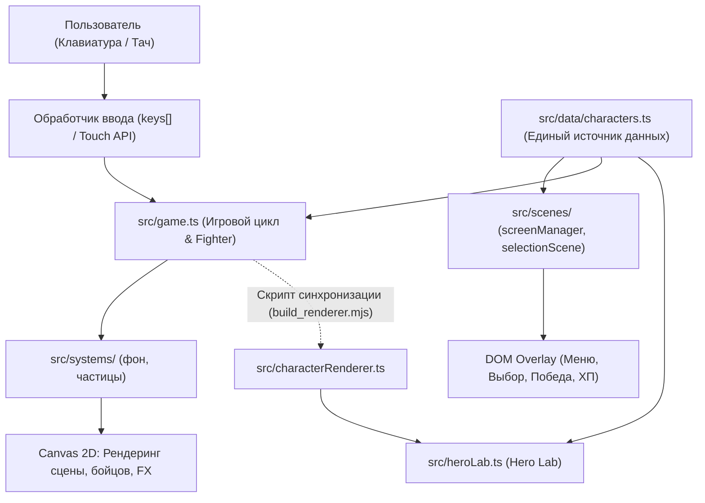
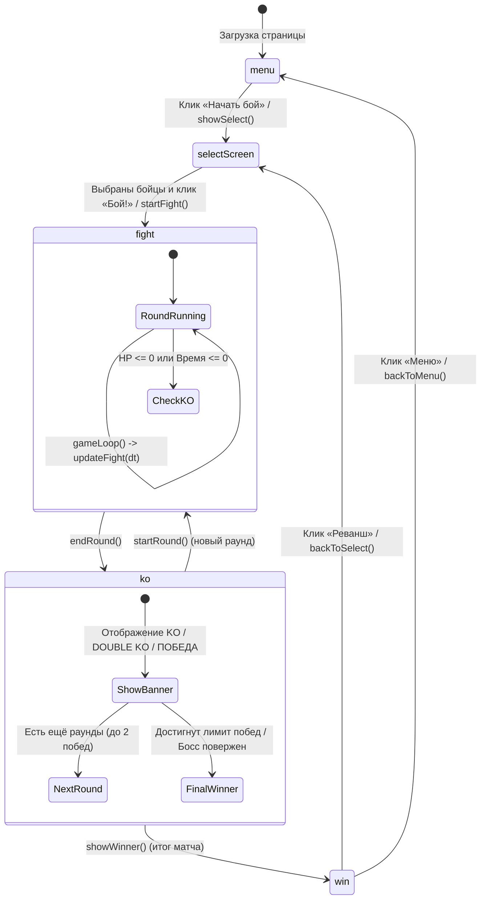

# Архитектура проекта «Друзья Файтинг»

В этом документе детально описано внутреннее устройство кодовой базы, разделение ответственности между компонентами, жизненный цикл матча и принципы расширения.

---

## 🏛 Общая концепция и архитектурный паттерн

Проект построен на гибридной модели:
1. **HTML5 Canvas 2D (Игровое ядро)**: отвечает за 60 FPS цикл матча, процедурный рендеринг бойцов (векторные силуэты, части тела, щупальца, анимации дыхания, ходьбы и ударов), физику прыжков, расчёт хитбоксов, частицы и эффекты тряски экрана.
2. **DOM UI Overlay (Интерфейс)**: оверлеи экранов (`menuScreen`, `selectScreen`, `winScreen`), плашки подсказок клавиш, сенсорные кнопки (D-pad) и меню выбора персонажей реализованы стандартным HTML/CSS и накладываются поверх `<canvas>`.

Такой подход обеспечивает высокую производительность в бою без лишнего DOM reflow, сохраняя при этом удобство верстки карточек бойцов и кнопок меню.



---

## 📁 Карта модулей и назначение файлов

```
friends-fighting/
├── index.html                  # HTML-оболочка основной игры и оверлеев
├── hero-lab.html               # HTML-оболочка лаборатории героев (Hero Lab)
├── package.json                # Конфигурация проекта, npm-скрипты, зависимости
├── tsconfig.json               # Базовый конфиг TypeScript
├── tsconfig.app.json           # Конфиг TypeScript для клиентского кода
├── vite.config.ts              # Конфиг Vite (многостраничная сборка)
├── scripts/                    # Инструменты сборки и кодогенерации
│   ├── build_renderer.mjs      # Экстрактор методов отрисовки из game.ts в characterRenderer.ts
│   ├── generate_svgs.mjs       # Генератор SVG-аватарок персонажей
│   ├── generate_og_cover.mjs   # Генератор обложек для соцсетей (OG Image)
│   ├── Exo2.ttf / RussoOne-Regular.ttf # Локальные шрифты
├── public/                     # Статические файлы (раздаются как есть)
│   ├── avatars/                # SVG и JPG аватарки бойцов и босса
│   └── og-cover.* / og-image.* # Обложки для превью в соцсетях
└── src/                        # Исходный код TypeScript
    ├── main.ts                 # Точка входа игры: подключение стилей и запуск game.ts
    ├── game.ts                 # Ядро игры: цикл requestAnimationFrame, класс Fighter, ИИ, хитбоксы
    ├── styles.css              # Стили основной игры и DOM-оверлеев
    ├── characterRenderer.ts    # Модульный рендерер моделей бойцов (используется в Hero Lab)
    ├── heroLab.ts              # Логика и интерактив страницы Hero Lab
    ├── heroLab.css             # Стили страницы Hero Lab
    ├── data/
    │   └── characters.ts       # Единый источник конфигураций бойцов, босса и баланса
    ├── game/
    │   ├── config.ts           # Разрешение Canvas, базовые масштабы, длительность раунда
    │   └── types.ts            # Типы состояний игры (GameState, PlayerMode, SelectionState)
    └── scenes/
        ├── screenManager.ts    # Утилиты переключения экранов (show/hide screen, touch, подсказки)
        └── selectionScene.ts   # Логика экрана выбора бойцов (сетка карточек, выбор P1/P2/Босс)
    └── systems/
        ├── background.ts        # Генерация и отрисовка ночного города
        ├── particles.ts         # Жизненный цикл и отрисовка игровых частиц
        └── versionChecker.ts    # Детектор обновлений игры и всплывающее уведомление
```

### Границы модулей

`game.ts` координирует матч и владеет классом `Fighter`: он связывает ввод, состояние раунда, ИИ и рендеринг персонажей. Независимые от DOM системы вынесены в `src/systems/` и получают необходимые данные через аргументы.

- `background.ts` хранит состояние звёзд и зданий и рисует арену.
- `particles.ts` владеет массивом частиц и предоставляет `spawnParticles`, `updateParticles`, `drawParticles`, `resetParticles`.
- `scenes/*` работают с DOM-экранами и не содержат физику боя.
- `game/config.ts` хранит общие размеры и тайминги; `data/characters.ts` — баланс персонажей.

Зависимости направлены к ядру: `systems` и `scenes` не импортируют `game.ts`. Это позволяет менять экран или визуальный эффект без изменений игрового состояния.

---

## 🔄 Жизненный цикл игры (State Machine)

Игра управляется глобальной переменной `gameState: GameState` (`'menu' | 'fight' | 'ko' | 'win'`):



### Детали состояний:
1. **`menu`**:
   - Отображается оверлей `#menuScreen`.
   - В Canvas работает фоновая отрисовка ночного города и звёздного неба (`drawBackground`).
2. **`fight`**:
   - Оверлеи скрыты (`body.fight-active`).
   - На каждом кадре выполняется `updateFight(dt)`:
     - Опрос клавиатуры / тач-контролов (`handleInput()`).
     - Расчёт логики ИИ (`handleBotLogic()` или `bossBotLogic()`).
     - Обновление позиции и анимаций бойцов (`player1.update()`, `player2.update()`).
     - Расталкивание тел при столкновении (`pushBodies()`).
     - Проверка пересечения хитбоксов ударов и тел (`checkHit()`, `checkProjectileHit()`).
     - Обновление босс-эффектов и снарядов (`updateBossFX()`, `checkBossFX()`).
     - Обновление частиц и затухание тряски экрана (`screenShake`).
     - Проверка условий завершения раунда (`hp <= 0` или таймер раунда `<= 0`).
3. **`ko`**:
   - Бойцы заморожены в текущих состояниях, таймер остановлен.
   - Воспроизводится эффект взрыва частиц, тряска экрана, плашка «KO», «DOUBLE KO» или «БОСС ПОВЕРЖЕН!».
   - Задержка 2.5–3.2 секунды перед переходом к следующему раунду или экрану победы.
4. **`win`**:
   - Показ экрана `#winScreen` с именем и цветом победителя.
   - Кнопки возврата в меню или реванша.

---

## 🎨 Система отрисовки и анимации

### 1. Процедурная отрисовка персонажей
В игре **не используются растровые спрайтшиты**. Все персонажи нарисованы кодом с помощью примитивов Canvas 2D (`ctx.arc`, `ctx.beginPath`, `ctx.quadraticCurveTo`, `ctx.fill`, `roundRect`):
- Каждый персонаж имеет уникальную функцию `drawX(time, idle, walk)` (например, `drawDima`, `drawLexa`, `drawDarkSergey`).
- Анимация дыхания (idle) рассчитывается через `Math.sin(time * 3) * 3`.
- Анимация шага рассчитывается через `Math.sin(animFrame * 0.8)`.
- Удары и суперприёмы трансформируют координаты конечностей в зависимости от фазы атаки `attackTimer / attackDuration`.

### 2. Синхронизация кода рендеринга (`build_renderer.mjs`)
Чтобы не дублировать сложный код отрисовки персонажей между боевым экраном (`src/game.ts`) и карточками в Hero Lab (`src/characterRenderer.ts`), используется скрипт:
```bash
node scripts/build_renderer.mjs
```
Скрипт читает блок методов `tentacle(...)` ... `drawSergey(...)` из `src/game.ts` и автоматически генерирует класс `CharacterModelViewer` в `src/characterRenderer.ts`.

> [!IMPORTANT]
> При добавлении или изменении визуальной модели персонажа в `src/game.ts`, **всегда** запускайте `node scripts/build_renderer.mjs`, чтобы обновить модели в Hero Lab!

---

## 📐 Баланс и конфигурация: единый источник правды

- Все числовые характеристики персонажей, имена, стили, описание и коэффициенты атак хранятся исключительно в:
  [**`src/data/characters.ts`**](../src/data/characters.ts)
- Константы холста, длительности раундов и базовые масштабы хранятся в:
  [**`src/game/config.ts`**](../src/game/config.ts)

**Категорически запрещается**:
- Зашивать статы, кулдауны или множители урона в HTML-разметку (`index.html`, `hero-lab.html`).
- Хардкодить размеры холста `960` и `540` внутри отдельных модулей (импортируйте `GAME_WIDTH`, `GAME_HEIGHT` из `src/game/config.ts`).

---

## 🚀 Правила расширения архитектуры

1. **Новые боевые механики**:
   - Если механика не зависит от DOM (например, комбо-счётчик, баффы, вампиризм, новые эффекты снарядов), добавляйте её в `Fighter` внутри `src/game.ts` или выносите в отдельный модуль в `src/systems/`.
2. **Новые экраны / UI-виджеты**:
   - Размещайте разметку в соответствующем HTML-файле (`index.html` или отдельный `.html`).
   - Логику управления экраном оформляйте отдельным модулем в `src/scenes/` (по аналогии с `selectionScene.ts`).
3. **Проверка целостности**:
   - После любых изменений в TypeScript модулях запускайте:
     ```bash
     npm run build
     ```
