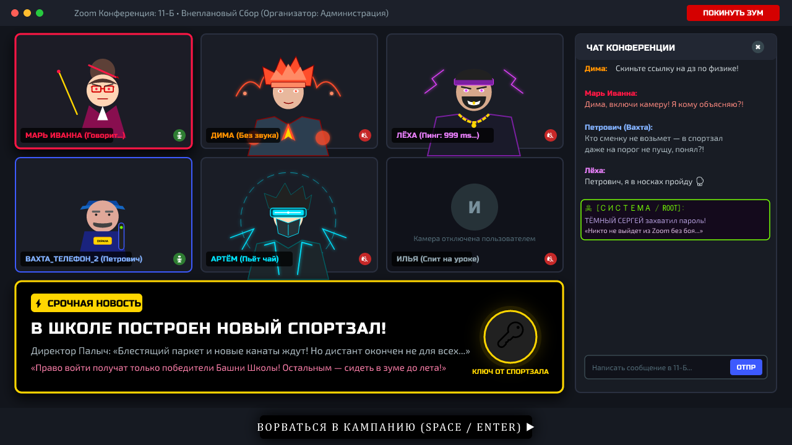
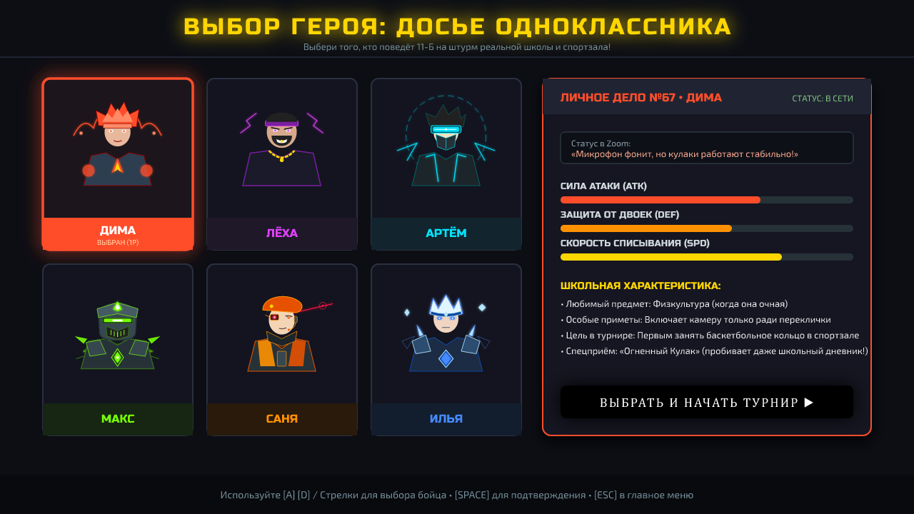
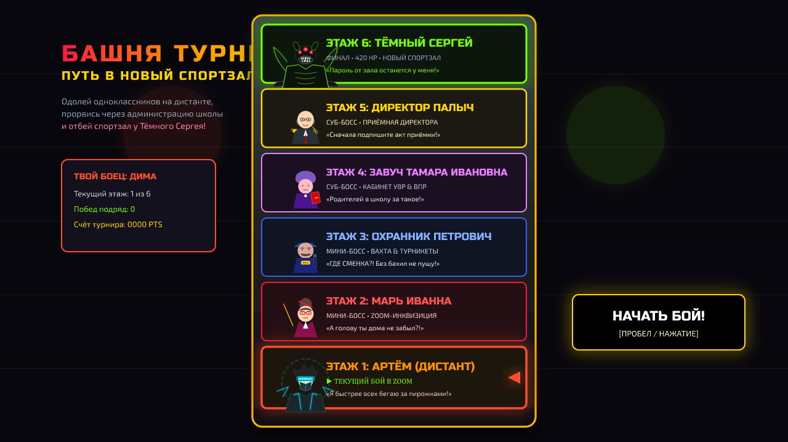
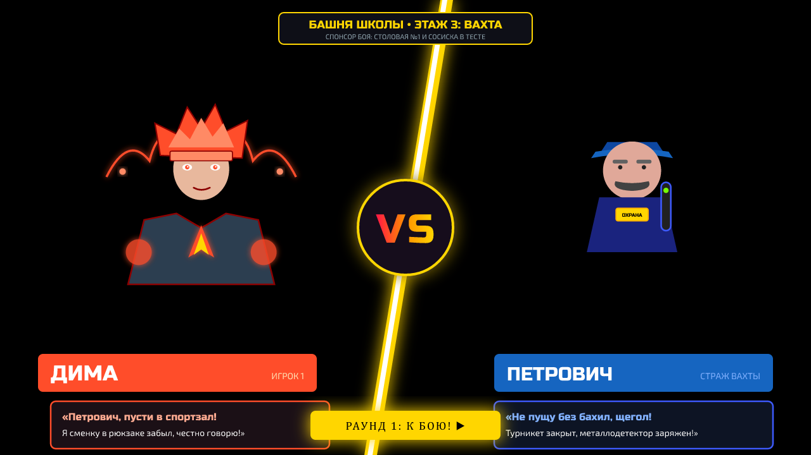
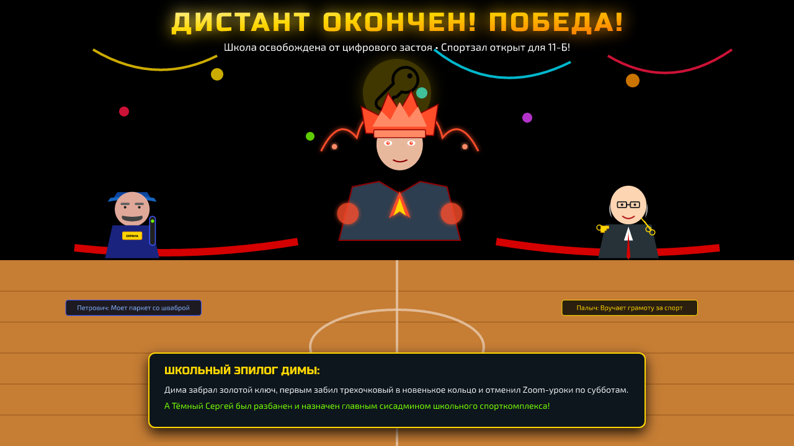

# 🏆 Режим Кампании: «Хроники Дистанта — Битва за Новый Спортзал»

Документация и концептуальное руководство по сюжетному режиму одиночного прохождения (Arcade Campaign Ladder) в пародийно-комедийном стиле культовых файтингов **Mortal Kombat** и **Street Fighter**.

---

## 🎒 1. Сюжетный лор и атмосфера

### Завязка
Ученики 11-Б класса уже несколько месяцев учатся на дистанционке: уроки проходят в **Zoom**, где постоянные крики *«Включите камеру!»*, *«Кто шуршит пакетом в микрофон?!»*, коты ходят по клавиатурам, а домашку списывают за 30 секунд до конца урока.

Внезапно в школьном чате взрывается новость: **в реальном здании школы наконец-то достроили новенький спортзал!** Там пахнет свежим лаком, на полу блестит новенький паркет, висят нескрипучие канаты и установлены мягкие волейбольные сетки.

### Конфликт
Директор школы Палыч и администрация объявляют:
> *«Спортзал один, а классов много. Дистант окончен не для всех! В зал войдут лишь те, кто докажет свою силу в Школьной Башне Турнира!»*

Но самое страшное: школьный хакер и главный заводила класса **Тёмный Сергей** захватил права администратора школьной сети, запаролил двери спортзала цифровым шифром из 67 знаков и объявил себя Владыкой Цифровой Бездны!

---

## 🏛 2. Иерархия Башни и Ростер Промежуточных Боссов

Кампания построена по принципу вертикальной аркадной лестницы (Mortal Kombat Tower):

```
       [ 👑 ВЕРШИНА: НОВЫЙ СПОРТЗАЛ ]
       ▲ Этаж 6: ГИГА-БОСС ТЁМНЫЙ СЕРГЕЙ (420 HP, 7 Void-атак)
       ▲ Этаж 5: СУБ-БОСС ДИРЕКТОР ПАЛЫЧ (Хозяин Госзакупок)
       ▲ Этаж 4: СУБ-БОСС ЗАВУЧ ТАМАРА ИВАНОВНА (Гроза Педсовета & ВПР)
       ▲ Этаж 3: МИНИ-БОСС ОХРАННИК ПЕТРОВИЧ (Страж Турникета и Сменки)
       ▲ Этаж 2: МИНИ-БОСС УЧИЛКА МАРЬ ИВАННА (Zoom-Инквизитор)
       ▲ Этаж 1: РАУНД В ZOOM: ОДНОКЛАССНИК (Артём / Лёха / Макс)
       [ 🏠 СТАРТ: ДОМАШНИЙ ДИВАН / ДИСТАНТ ]
```

### Досье Промежуточных Боссов:

| Этаж | Босс | Титул & Роль | Особые Механики & Спецприёмы | Коронная Реплика |
|:---:|---|---|---|---|
| **Этаж 2** | **Марь Иванна** | *Zoom-Инквизитор • Классный руководитель* | Метание красных ручек-снарядов; крик в микрофон (оглушение); статус **«MUTE»** (блокирует спецприёмы игрока на 3 сек). | *«А голову ты дома не забыл?! Камеру включи!»* |
| **Этаж 3** | **Охранник Петрович** | *Страж Турникета • Вахта №1* | Удар металлодетектором; бросок связки бахил; защитная стойка **«Турникет заклинило»** (непробиваемый суперблок). | *«ГДЕ СМЕНКА?! Без бахил даже на порог не пущу!»* |
| **Этаж 4** | **Завуч Тамара Ивановна** | *Гроза Педсовета • Завуч по УВР* | Атака тяжеленной папкой с отчётами ВПР; лазер из указки со стразами; ульта **«Вызов родителей в школу»**. | *«Ты сорвал открытый урок! С родителями ко мне в кабинет!»* |
| **Этаж 5** | **Директор Палыч** | *Хозяин Госзакупок • Директор школы* | Золотые ножницы для разрезания ленточек; бросок золотой гири ГТО; призыв строительных лесов. | *«Сначала подпишите акт приёмки спортзала!»* |
| **Этаж 6** | **Тёмный Сергей** | *ГИГА-БОСС БЕЗДНЫ • Сисадмин Zoom* | 420 HP, щупальца бездны, шипы, тёмный дождь, метеоритный лаг, захват экрана. | *«Пароль от спортзала останется в Бездне!»* |

---

## 🖥 3. Архитектура и Экраны Кампании (с фейк-скриншотами)

Кампания разделена на 5 отдельных экранов, каждый из которых выполнен в собственном пародийном стиле:

### Экран 1: Сюжетное Zoom-Интро (`01_zoom_intro.png`)
Пародия на типичный урок в Zoom: плитки одноклассников (кто-то пьёт чай, у кого-то выключена камера, у Лёхи пинг 999 ms), живой чат конференции и всплывающее экстренное сообщение об открытии спортзала.



---

### Экран 2: Выбор Героя — «Личное Дело Школьника» (`02_dossier_select.png`)
Стилизован под окно профиля ученика в Zoom. Игрок выбирает своего бойца и видит его пародийную характеристику: любимый предмет, школьные проступки, статы и мотивацию пойти в спортзал.



---

### Экран 3: Башня Турнира — Mortal Kombat Ladder (`03_mortal_kombat_tower.png`)
Классический каменный столб турнира MK, символизирующий школьную иерархию снизу вверх: от дистанционки в зуме через школьную вахту и кабинет завуча прямо на крышу спортзала к Тёмному Сергею.



---

### Экран 4: Прематч VS Диалоги — Street Fighter 6 Style (`04_street_fighter_vs.png`)
Динамичный сплит-скрин с диагональной молнией, крупными портретами соперников и острыми школьными диалогами перед боем.



---

### Экран 5: Школьный Триумф и Эпилог (`05_gym_victory_ending.png`)
Победный экран на блестящем новеньком паркете спортзала: разрезанная красная ленточка, конфетти, побежденные боссы в пародийных амплуа (Петрович моет пол, Палыч вручает грамоту) и персональная концовка бойца.



---

## ⚔️ 4. Таблица Прематч-Диалогов (Street Fighter Style)

| Игрок | Оппонент | Реплика Игрока | Ответ Оппонента |
|---|---|---|---|
| **Дима** | **Марь Иванна** | *«Марь Иванна, у меня камера сломалась, правда!»* | *«А двойку в журнал я тебе без камеры поставлю!»* |
| **Дима** | **Петрович** | *«Петрович, пусти в спортзал! Сменка в рюкзаке!»* | *«Не пущу без бахил, щегол! Турникет на замке!»* |
| **Лёха** | **Тамара Ивановна** | *«Тамара Ивановна, я же случайно окно мячом разбил!»* | *«Весь педсовет на ушах! Пиши объяснительную!»* |
| **Артём** | **Директор Палыч** | *«Палыч, отдайте ключ от спортзала, нам на волейбол надо!»* | *«Только после субботника и покраски забора!»* |
| **Любой боец**| **Тёмный Сергей** | *«Серёга, верни пароль от спортзала и выруби лаги!»* | *«Глупцы... Бездна не знает уроков физкультуры!»* |

---

## 🛠 5. Генерация и обновление графики скриншотов

Все скриншоты для документации генерируются автоматически в высоком разрешении **1280x720 HD** при помощи скрипта:
```bash
node scripts/generate_campaign_screens.mjs
```
Скрипт использует векторные определения персонажей из `scripts/generate_svgs.mjs`, шрифты `Russo One` и `Exo 2`, а также библиотеки `@resvg/resvg-js` и `sharp`.
