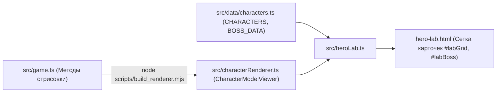

# Лаборатория героев (Hero Lab)

**Hero Lab** — это интерактивная визуальная лаборатория и справочник по всем персонажам игры. Она доступна по отдельному URL [`/hero-lab.html`](../hero-lab.html) и запускается кнопкой «Hero Lab» на главном экране меню.

---

## 🎯 Назначение и возможности

Hero Lab выполняет две ключевые функции:
1. **Для игроков**: интерактивная энциклопедия, где можно детально изучить параметры каждого бойца, посмотреть его внешний вид, протестировать анимации атак и ознакомиться с описанием суперприёмов.
2. **Для разработчиков и художников**: тестовый полигон (sandbox) для проверки визуальных пропорций, цветов, анимаций ударов и эффектов частиц без необходимости запускать полноценный матч.

### Основные фичи:
- **Два режима отображения**:
  - 🎮 **Модель бойца (`model`)**: процедурная динамическая модель Canvas 2D с живой физикой дыхания, частиц и анимаций.
  - 🎨 **Арт-карта (`art`)**: статичная векторная SVG-иллюстрация в высоком разрешении.
- **Интерактивные кнопки анимаций**:
  - `Стойка`: базовое дыхание и ожидание.
  - `Удар`: обычная атака ближнего боя.
  - `Тяжёлый`: сильный удар с замахом.
  - `Спец`: суперприём персонажа (с аурой, рывком или снарядом).
- **Интерактивный клик**: клик по сцене персонажа заставляет его выполнить атаку.
- **Подробные характеристики**:
  - Визуальные прогресс-бары: `ATK`, `DEF`, `SPD`.
  - Числовые значения: HP, базовая скорость, сила удара и защита.
  - Список приёмов с описанием и кулдауном в секундах.
- **Секция Гига-Босса**: отдельный крупный стенд Тёмного Сергея с описанием всех 7 способностей и их клавиш.

---

## 🧩 Архитектура Hero Lab



### Файлы компонента:
- [**`hero-lab.html`**](../hero-lab.html) — разметка контейнера, заголовок, глобальные переключатели вида.
- [**`src/heroLab.ts`**](../src/heroLab.ts) — инициализация карточек, привязка событий кликов, расчёт секунд кулдаунов и запуск анимационного цикла `requestAnimationFrame`.
- [**`src/heroLab.css`**](../src/heroLab.css) — стили карточек, сетки, неонового свечения и адаптивной верстки.
- [**`src/characterRenderer.ts`**](../src/characterRenderer.ts) — класс `CharacterModelViewer`, управляющий холстом конкретной карточки.

---

## ⚙️ Класс `CharacterModelViewer`

Каждая карточка персонажа в Hero Lab содержит свой собственный тег `<canvas class="hero-canvas">`.
Для каждого холста создается экземпляр `CharacterModelViewer`:

- Хранит текущее состояние анимации (`attacking`, `attackType`, `attackTimer`, `animTimer`, `particles[]`).
- Метод `triggerAttack(type)` запускает соответствующую анимацию удара.
- Метод `update(dt)` обновляет таймеры и частицы.
- Метод `draw(ctx, width, height, time)` отрисовывает постамент, тень, самого персонажа и эффекты.

---

## 🔄 Синхронизация кода рендеринга (`build_renderer.mjs`)

Чтобы исключить дублирование кода отрисовки бойцов между основным боем (`src/game.ts`) и Hero Lab (`src/characterRenderer.ts`), используется генератор:

```bash
node scripts/build_renderer.mjs
```

### Как это работает:
1. Скрипт открывает `src/game.ts`.
2. Находит сигнатуру начала методов рисования:
   ```javascript
   tentacle(time,x0,y0,dir,len,speed,phase,color,w){
   ```
3. Извлекает весь блок вспомогательных и персонажных методов отрисовки вплоть до `drawProjectileVis`.
4. Встраивает эти методы внутрь класса `CharacterModelViewer` и сохраняет обновленный файл `src/characterRenderer.ts`.

> [!TIP]
> При изменении графики бойца редактируйте код **только в `src/game.ts`**, после чего запускайте `node scripts/build_renderer.mjs`. Не редактируйте `src/characterRenderer.ts` вручную, так как эти изменения будут перезаписаны скриптом!
